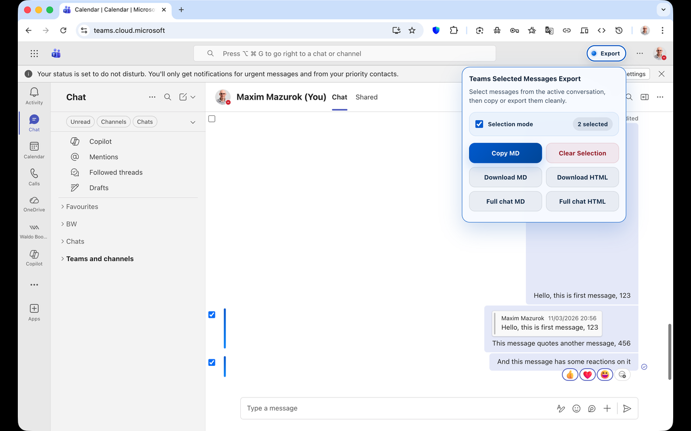
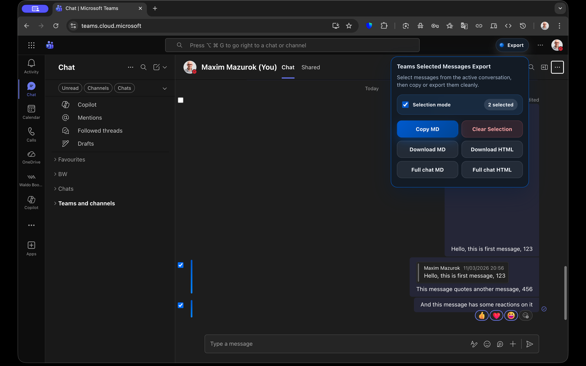
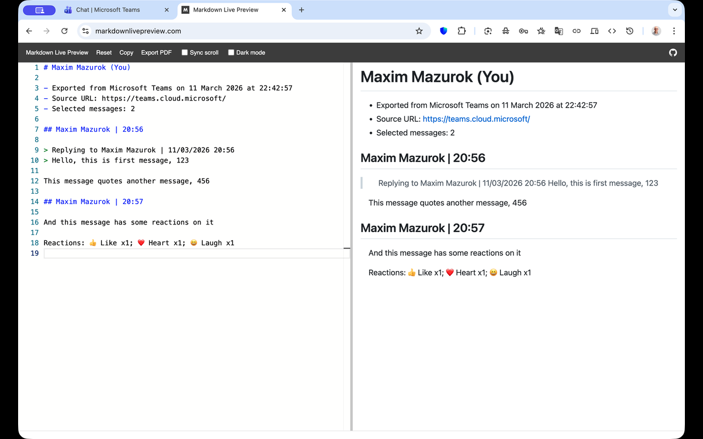
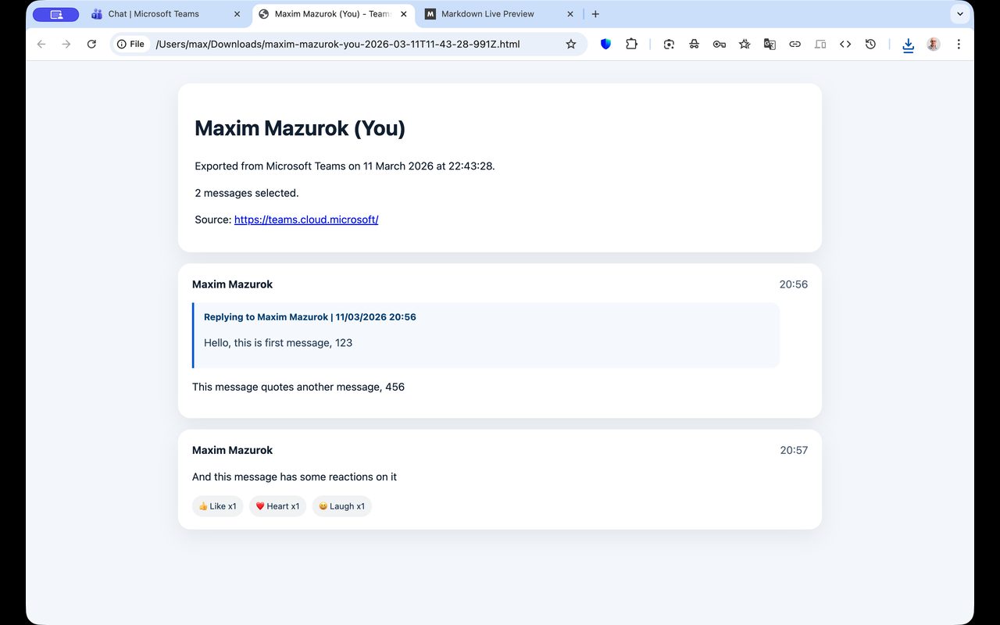

# Teams Selected Messages Export

A Chrome extension that lets you select and export Microsoft Teams messages to Markdown or HTML — right from the Teams web app.

> **Disclaimer:** This project was originally created using the OpenAI Codex app with GPT 5.4 and then finalized using Claude Opus 4.6 copilot agent mode in VS Code.

## Features

- **Click-to-select messages** — click individual messages or shift-click to select a range
- **Visible checkboxes** with shift-click range support
- **Copy to clipboard** — quick-copy selected messages as Markdown
- **Download exports** — save selected messages as Markdown or HTML files
- **Full chat history export** — fetches the entire conversation via the Teams REST API and downloads as Markdown or HTML (falls back to scroll-harvesting when the API is unavailable)
- **Rich formatting** — inline `@mentions`, reply blockquotes, reactions, and image placeholders
- **Theme-aware UI** — follows Teams light/dark theme automatically
- **Non-intrusive** — export controls embed into the Teams title bar

## Demo

https://github.com/user-attachments/assets/f514532d-71bf-4869-aa98-4dfab8fb7974

## Screenshots

## Install

1. Download the latest `teams-selected-messages-export-extension.zip` from [Releases](../../releases/latest).
2. Unzip the archive.
3. Open `chrome://extensions` in Chrome.
4. Enable **Developer mode** (top-right toggle).
5. Click **Load unpacked** and select the unzipped folder.
6. Open [Microsoft Teams](https://teams.microsoft.com) in Chrome.

## Usage

1. Click the **Export** button in the Teams title bar (top-right, next to settings/avatar).
2. The export panel opens and selection mode activates automatically.
3. Click messages to select them. Hold **Shift** and click to select a range.
4. Use the panel actions:

| Action | Description |
|--------|-------------|
| **Copy MD** | Copy selected messages as Markdown to clipboard |
| **Clear Selection** | Deselect all messages |
| **Download MD** | Download selected messages as a Markdown file |
| **Download HTML** | Download selected messages as an HTML file |
| **Full chat MD** | Export the entire chat history as Markdown (via API when available, otherwise scroll-harvest) |
| **Full chat HTML** | Export the entire chat history as HTML (via API when available, otherwise scroll-harvest) |

Copying Markdown closes the panel and stops selection mode, but preserves your selection. Reopening the panel restores the selected messages.

## How full chat export works

The extension uses a two-tier approach for full chat history export:

1. **Primary: REST API** — A MAIN-world hook reads the MSAL IC3 Bearer token from `localStorage`, detects the region from session data, and resolves the active conversation ID from the DOM. The background service worker then fetches all messages via the Teams Chat Service REST API with pagination, which is fast and complete.
2. **Fallback: Scroll-harvesting** — If the API path is unavailable (token not captured, conversation ID unresolvable, or API returns an error), the extension scrolls through the visible chat, captures message snapshots from the DOM, and accumulates them until it reaches the top.

The API path is preferred because it is faster, captures the full history regardless of virtualization, and does not disturb the user's scroll position.

## Current limitations

- Reactions show emoji, name, and count but actor names are best-effort (DOM-scraped for selected messages, API-provided for full chat export).
- Selected-message export depends on the visible Teams DOM and current row selectors.
- The API auth token (MSAL IC3 Bearer JWT) is read from `localStorage` and may expire after an extended session — reloading Teams refreshes it.
- Teams Cloud URLs have no path-based routing, so the conversation ID must be extracted from the DOM rather than the URL.
